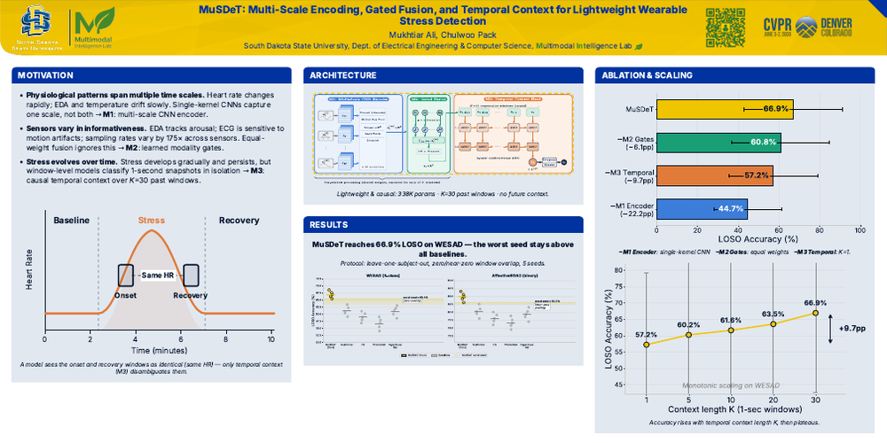
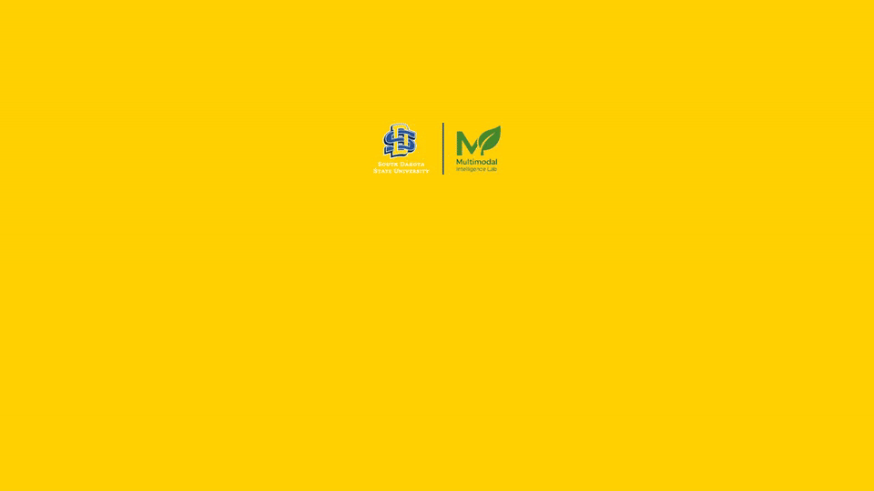
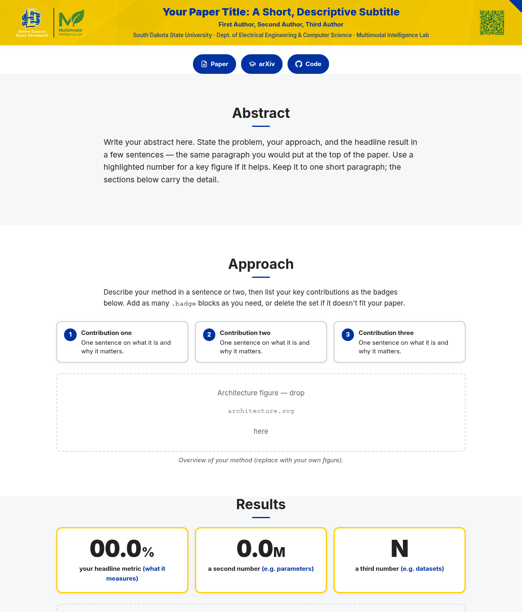
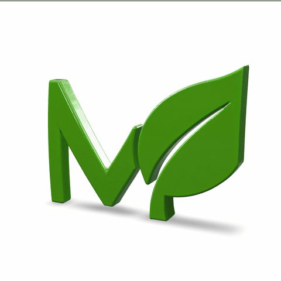
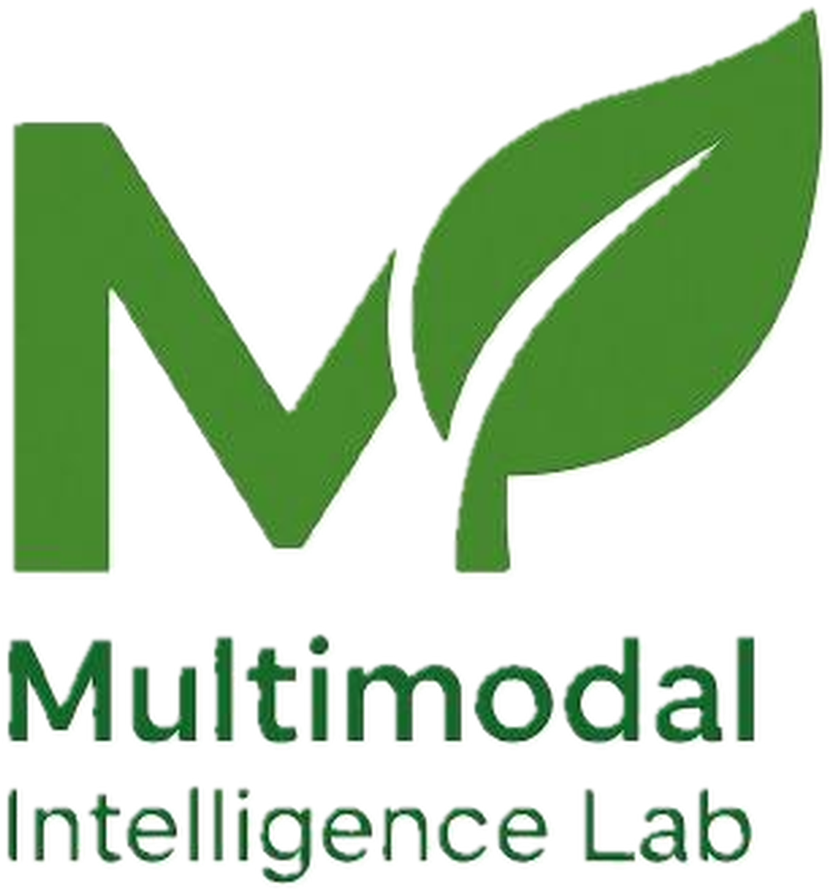

# MINT

The Multimodal Intelligence Lab (MINT) brand kit — one place for the SDSU lab's visual identity and
the things built from it. `brand/` holds the identity (logos, colors, fonts, icons, QR) and is the
**single source of truth**; every other folder is a template **built on it**. No build step to *use*
the brand, no dependencies at rest — plain files you open in a browser.

```
mint-brand/
  brand/          ← the foundation — logos · colors.css · fonts · icons · qr   (single source of truth)
  posters/        ← HTML→PDF research-poster templates   — many sizes, one template
  readme-header/  ← branded README header (HTML→PNG)      — the banner at the top of this file
  slides/         ← conference slide decks               — 1280×720 stage, scaled to fit
  videos/         ← auto-playing teasers → MP4/GIF        — timeline + optional voiceover, on-box render
  demo-pages/     ← responsive project / paper pages      — the same brand chrome, built for the web
  logo-3d/        ← the M+leaf mark in 3D (GLB)           — spinning viewer + two-line embed
  docs/samples/   ← the showcase images below             — regenerable; not source
```

## What you can make
One template per artifact — copy it, edit your content, render. Each folder has a `README.md` with the
full steps; the one command that produces the artifact is shown here.

<table>
<tr>
  <td width="42%"></td>
  <td><b>README header</b> — a branded PNG banner for a repo or paper.<br><br>
  <code>cd readme-header && node build.mjs my-header.html</code><br>
  → <code>dist/my-header.png</code> · see <a href="readme-header/README.md">readme-header/</a></td>
</tr>
<tr>
  <td></td>
  <td><b>Research poster</b> — HTML → print-ready PDF, any conference size.<br><br>
  <code>cd posters && node build.mjs my-poster.html 48x36</code><br>
  → <code>dist/my-poster-48x36.pdf</code> · see <a href="posters/README.md">posters/</a></td>
</tr>
<tr>
  <td></td>
  <td><b>Slides</b> — a branded 1280×720 slide deck that scales to fit any screen.<br><br>
  Copy <code>slides/deck.html</code>, edit your slides, open it in a browser (no build).<br>
  Or eject a standalone, repo-free deck anywhere: <code>node slides/new.mjs ~/talks/my-talk</code><br>
  → see <a href="slides/README.md">slides/</a></td>
</tr>
<tr>
  <td></td>
  <td><b>Teaser video</b> — an auto-playing timeline (the timed sibling of the slides) → MP4/GIF.<br><br>
  <code>cd videos && node record.mjs</code><br>
  → <code>dist/teaser.mp4</code> · see <a href="videos/README.md">videos/</a></td>
</tr>
<tr>
  <td></td>
  <td><b>Demo page</b> — a responsive, branded project / paper page for the web.<br><br>
  Copy <code>demo-pages/page.html</code>, edit your content, open it in a browser (no build).<br>
  → see <a href="demo-pages/README.md">demo-pages/</a></td>
</tr>
<tr>
  <td align="center"></td>
  <td><b>3D logo</b> — the M+leaf mark as an interactive 3D model: spin it, zoom it, embed it.<br><br>
  Serve the repo root (<code>python3 -m http.server</code>) and open <code>logo-3d/viewer.html</code>,
  or embed it in any web page with two lines — <code>model-viewer.min.js</code> + the GLB.<br>
  → see <a href="logo-3d/README.md">logo-3d/</a></td>
</tr>
<tr>
  <td></td>
  <td><b>brand/</b> — logos, <code>colors.css</code>, fonts, icons, QR: the single source every module
  is built on. You reference it (<code>../brand/…</code>); you never copy or recolor it.<br><br>
  → see <a href="brand/logos/README.md">brand/logos/</a></td>
</tr>
</table>

## For AI agents
The two prime directives are **`brand/` is the single
source of truth** (reference `../brand/…`; never copy a logo or paste a hex) and **stay dependency-free
at rest** (no `node_modules`, no CDN; build steps use on-box tools only). Before doing anything, read the
full contract in **[`AGENTS.md`](AGENTS.md)** (the root rules) and the **`AGENTS.md`** in the folder you're
working in (the task-specific rules). Every folder has one. Don't reinvent the rules from this overview —
follow the contract.

## Authors

<table>
<tr>
<td align="center" width="190">
  <a href="https://github.com/GitAliGator">
    <br>
    
  </a>
</td>
<td align="center" width="190">
  <a href="https://github.com/hdubey-debug">
    <br>
    
  </a>
</td>
</tr>
</table>
